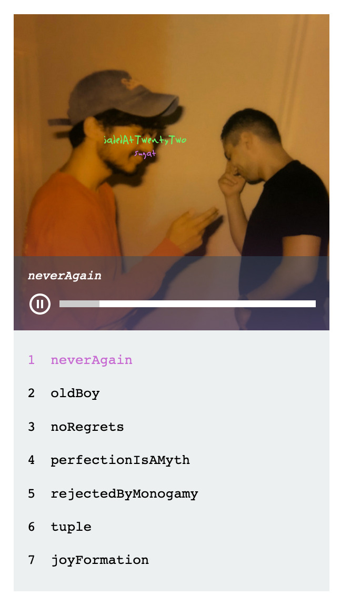

# album-player

 
[](https://badge.fury.io/js/album-player)



album-player is a simple react component that allows you to display and play tracks from an album 
using the html5 audio api. It takes in an album struct where the tracks are specifed as publicly
accessible urls to mp3 files.

```js
{
	cover: "https://storage.googleapis.com/gb-albums/jadedAtTwentyTwo/cover.jpeg",
	title: "jadedAtTwentyTwo",
	tracks: [
	   {
		  index: 1,
		  name: "neverAgain",
		  url: "https://storage.googleapis.com/gb-albums/jadedAtTwentyTwo/01-neverAgain.mp3"
	   },
	   {
		  index: 2,
		  name: "oldBoy",
		  url: "https://storage.googleapis.com/gb-albums/jadedAtTwentyTwo/02-oldBoy.mp3"
       },
    ]
}
```

## usage

```
yarn add album-player
```

Note that album-player requires styled-components and react as peer dependencies.

```js
import AlbumPlayer from 'album-player';

ReactDOM.render(
    <AlbumPlayer {...album}>,
    root,
);
```

This will render the default album player with the default groupbool styles.

## themes

album-player uses [styled-components](https://styled-components.com/) to apply styles
to the various components. All configurable styles are driven by the album-player `DefaultTheme`.

```ts
interface DefaultTheme {
	font: string;
	base: string;
	controls: {
		base: string;
		background: string;
		fill: string;
		hover: string;
	};
	tracks: {
		active: string;
		hover: string;
	};
}
```

A default bool theme is used for the default `AlbumPlayer` export however it can easily
be over-ridden using a `ThemeProvider`.

```js
import { AlbumPlayer } from 'album-player';
import { ThemeProvider } from 'styled-components';

ReactDOM.render(
	<ThemeProvider theme={customTheme}>
		<AlbumPlayer {...album}>
	</ThemeProvider>,
	root,
);
```